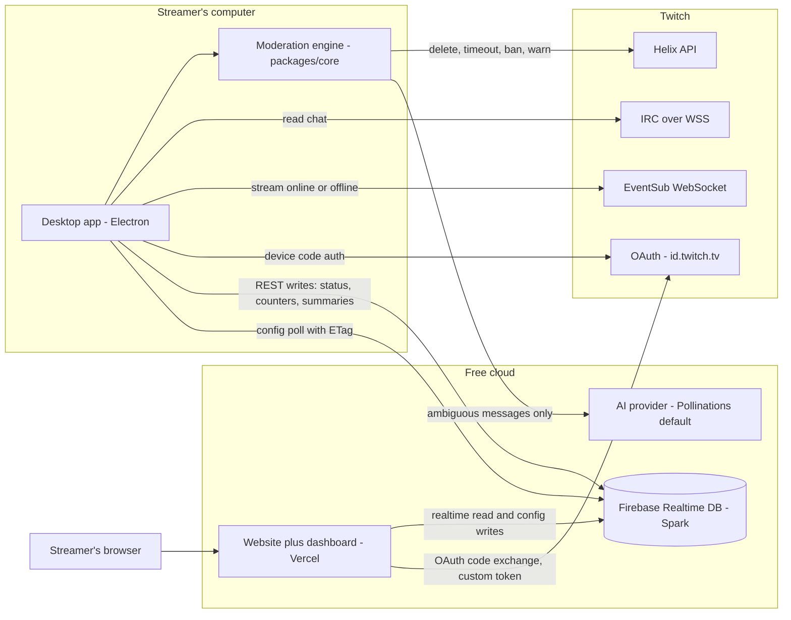
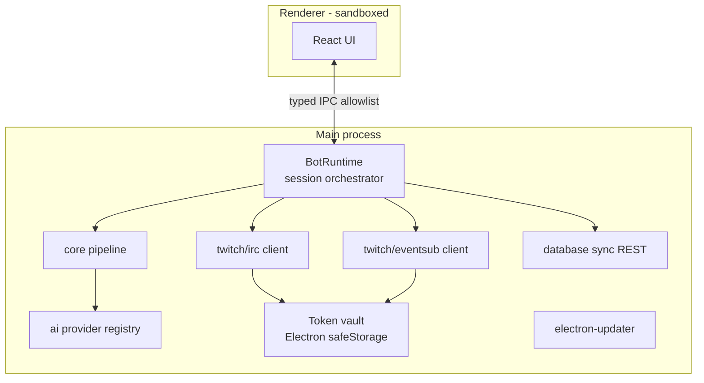

# OZENMod — Architecture

Global technical architecture: topology, monorepo layout, Twitch integration,
updates, CI/CD, and the extension points that make the premium tier possible later
without rewrites.

---

## 1. High-level topology (free tier)

Everything heavy runs on the streamer's computer. Cloud pieces are free-plan only.



Key properties:

- **The bot holds no persistent Firebase connection.** It writes via the RTDB REST
  API and polls config cheaply (ETag). This sidesteps the Spark plan's
  100-simultaneous-connections limit — see [DATABASE.md §6](./DATABASE.md).
- **No server middleman for chat**: messages go Twitch → app directly; the AI sees
  only the few messages that need it.
- The only server-side code is a pair of tiny Vercel serverless functions for the
  OAuth code exchange (the client secret never ships in clients).

## 2. Monorepo layout

npm workspaces (no paid tooling). Packages are framework-free TypeScript unless
stated; apps consume packages, never the reverse.

```
OZENMod/
├── apps/
│   ├── web/                    # Next.js (App Router) — site + dashboard + auth API
│   │   ├── src/app/            #   routes (see PRODUCT.md §5)
│   │   ├── src/app/api/        #   serverless: /api/auth/* (code exchange, custom token)
│   │   ├── src/components/     #   dashboard & marketing components
│   │   └── src/lib/            #   firebase client, twitch oauth helpers
│   └── desktop/                # Electron app
│       ├── src/main/           #   main process: bot runtime, token vault, updater, tray, IPC
│       ├── src/preload/        #   typed, allowlisted IPC bridge
│       └── src/renderer/       #   React + Vite + Tailwind UI (Control Room, Logs, Settings…)
├── packages/
│   ├── core/                   # moderation engine: pipeline stages, decision engine,
│   │                           #   warning ladder, session state (pure TS, zero I/O)
│   ├── ai/                     # provider interface, registry, built-in providers,
│   │                           #   prompt contract, verdict schema & validation
│   ├── twitch/                 # IRC client (WSS), Helix client, EventSub WS client,
│   │                           #   OAuth (device flow + code flow helpers), scopes
│   ├── database/               # RTDB schema types, REST + SDK clients, session
│   │                           #   lifecycle (create/summarize/cleanup), config sync
│   ├── shared/                 # zod config schemas, constants, result types, logger,
│   │                           #   text normalization utilities
│   └── ui/                     # shared design tokens + primitives used by web & renderer
├── docs/                       # this documentation
├── design/                     # mockups + screenshots (design phase)
├── .github/                    # workflows, issue & PR templates
└── package.json                # workspaces root: lint, typecheck, test, build scripts
```

### Dependency rules

```
apps/web      → packages/{ui,shared,database,twitch(types only)}
apps/desktop  → packages/{ui,shared,core,ai,twitch,database}
packages/core → packages/shared            (nothing else; no I/O, no Electron, no fetch)
packages/ai   → packages/shared
packages/twitch → packages/shared
packages/database → packages/shared
```

`core`, `ai`, `twitch`, `database` must run in plain Node — that is what lets the
future premium tier host them server-side unchanged.

## 3. Desktop app runtime



- **Main process** owns everything sensitive: tokens, network, the engine.
- **Renderer** is fully sandboxed (`contextIsolation`, no `nodeIntegration`) and
  talks through a small typed IPC surface (`startBot`, `stopBot`, `getStatus`,
  `onFeedEvent`, `updateSettings`, …).
- The moderation pipeline is synchronous & pure (`core`); the runtime feeds it
  messages and executes the actions it returns (Helix calls, RTDB writes, feed events).

## 4. Website runtime

- **Next.js App Router**, static-first: marketing pages are fully static (free CDN).
- Dashboard pages are client components using the Firebase JS SDK with
  per-user rules (see [SECURITY.md §4](./SECURITY.md)).
- **Serverless API routes** (Vercel free plan):
  - `POST /api/auth/twitch` — exchanges the OAuth `code` (client secret lives only
    in Vercel env vars), validates the Twitch identity, mints a **Firebase custom
    token** (Admin SDK), returns it.
  - `POST /api/auth/desktop` — same custom-token mint for the desktop app,
    authenticated by its Twitch access token (device flow has no secret).
  - `GET /api/health` — version + status for the app's connectivity check.
- No other backend exists. The dashboard reads/writes RTDB directly under
  security rules.

## 5. Twitch integration

### 5.1 Authentication

| Client | Flow | Why |
| --- | --- | --- |
| Desktop app | **Device Code Grant** (`id.twitch.tv/oauth2/device`) | Made for apps without a secret; user types a short code at `twitch.tv/activate`. Refresh tokens supported. |
| Website | **Authorization Code** (server-side exchange on Vercel) | Standard web flow; secret stays server-side; result is bridged to Firebase Auth via custom token. |

Tokens: access + refresh stored in the OS keychain via Electron `safeStorage`
(desktop) / never stored client-side beyond the Firebase session (web).

### 5.2 Scopes (minimal)

| Scope | Used for |
| --- | --- |
| `chat:read`, `chat:edit` | Read chat; post warning messages |
| `moderator:manage:chat_messages` | Delete single messages |
| `moderator:manage:banned_users` | Timeout / ban / unban |
| `moderator:manage:warnings` | Native Twitch warnings (optional ladder step) |
| `moderator:read:chatters` | Flood/raid heuristics (chatter count) |

If the bot runs as a dedicated account, the streamer grants it the moderator role;
the app verifies effective permissions at startup and reports missing ones.

### 5.3 Chat & events

- **IRC over WSS** (`wss://irc-ws.chat.twitch.tv`) with tags capability — the
  engine needs badges (mod/VIP/sub), message ids and user ids from tags.
- **Helix** for actions: `DELETE /moderation/chat` (message), `POST /moderation/bans`
  (timeout = ban with duration), `POST /moderation/warnings`.
- **EventSub over WebSocket** (free, serverless): `stream.online`, `stream.offline`
  drive the session lifecycle; reconnect + resubscribe handled by `packages/twitch`.
- Rate limits respected centrally in the Helix client (token bucket, retry-after).

## 6. AI layer

See [AI-PROVIDERS.md](./AI-PROVIDERS.md). Summary: `packages/ai` exposes
`AIProvider` implementations behind a registry; `core` asks for a verdict only when
its local stages mark a message ambiguous; verdicts are strict-JSON, validated,
with timeouts and a conservative local fallback. Default provider: **Pollinations**
(free, no key). BYO keys never leave the streamer's machine.

## 7. Data layer

See [DATABASE.md](./DATABASE.md). Summary: permanent data = small config +
lifetime counters + last-session summary; temporary data = per-session node
(status heartbeat, counters, warnings, capped recent events) deleted at stream end,
swept at next startup if the app crashed.

## 8. Updates & releases

- **electron-updater** with the GitHub Releases provider (free).
  - Windows (NSIS): background download, install on restart. Works unsigned
    (SmartScreen caveat documented on the download page).
  - macOS (DMG/ZIP): auto-install requires paid signing, so the free tier ships
    *notify + open download page*. The moment a signing cert exists, flipping to
    full auto-update is config-only.
- **Release integrity:** every release publishes `SHA256SUMS.txt`; the download
  page links it.
- **Versioning:** SemVer; `CHANGELOG.md` follows Keep a Changelog.

## 9. Premium-ready extension points

Implemented now (cheap), used later:

1. **`BotRuntime` interface** in `packages/core` — the desktop main process is one
   implementation ("local runtime"); a hosted worker would be a second one. The
   engine, providers and database packages take a runtime context, not Electron APIs.
2. **`runtime` field** on session nodes (`"desktop"` now, `"hosted"` later) so data
   and dashboard code need no migration.
3. **Config schema versioning** (`configVersion`) with forward-compatible parsing.
4. **Auth bridge already server-side** (custom tokens minted on Vercel) — a hosted
   runtime authenticates the same way.

Nothing else premium is built now.

## 10. CI/CD (GitHub Actions — free for public repos)

| Workflow | Trigger | Jobs |
| --- | --- | --- |
| `ci.yml` | PRs + pushes to `main` | install → lint (ESLint) → format check (Prettier) → typecheck (tsc strict) → unit tests (Vitest) → build web + packages |
| `release.yml` | Tag `v*` | matrix `windows-latest` / `macos-latest`: build desktop with electron-builder → generate checksums → create GitHub Release with installers + `SHA256SUMS.txt` |
| Vercel Git integration | push / PR | web preview + production deploys (free, no Action needed) |

## 11. Technology choices & free plans

| Tech | Role | Free-plan reality check |
| --- | --- | --- |
| Next.js + React + TypeScript + Tailwind | Website & dashboard | OSS |
| Vercel | Hosting + serverless auth routes | Hobby plan: 100 GB-h functions, HTTPS, previews |
| Firebase Realtime Database | Config + live session sync | Spark: 1 GB storage, 10 GB/mo transfer, 100 concurrent connections — design explicitly budgets for this (DATABASE.md) |
| Firebase Auth (custom tokens) | Dashboard identity | Free |
| Electron + Vite + React | Desktop app | OSS |
| electron-builder + electron-updater | Installers + updates | OSS, GitHub Releases hosting free |
| Twitch IRC / Helix / EventSub WS / OAuth | Chat + actions + lifecycle | Free |
| Pollinations | Default AI provider | Free, keyless |
| Ollama | Optional local AI | OSS, runs on user machine |
| GitHub + Actions | Repo, CI, releases | Free for public repos |
| ESLint, Prettier, Vitest, zod | Quality | OSS |

No paid dependency exists anywhere in the free tier.
