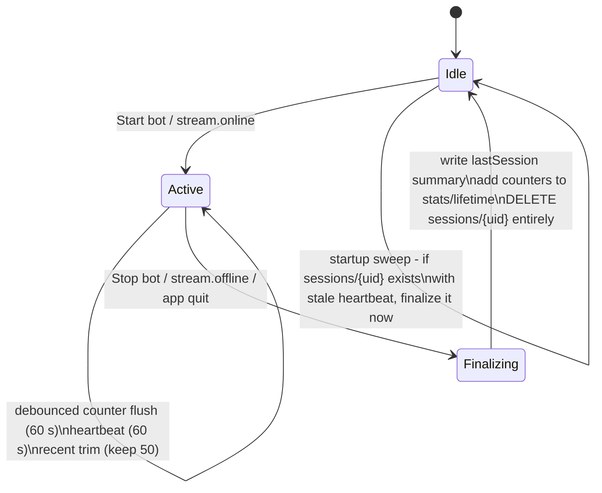

# OZENMod — Firebase Realtime Database Design

The database is deliberately tiny. It stores **configuration, small aggregates and
a short-lived session node per channel** — never chat logs, never unbounded lists.
Everything temporary cleans itself up.

---

## 1. Principles

1. **Two data classes, two lifecycles.**
   - *Permanent*: user/channel settings, lifetime counters, last-session summary.
     Kept only because the product needs them. Bounded size (< ~50 KB per channel).
   - *Temporary (session)*: warnings, live counters, recent events, status.
     Exists only while the bot is online; deleted automatically at stream end.
2. **The chat itself is never stored.** Moderation events may keep an optional
   truncated snippet (≤ 80 chars, off by default) for the dashboard; full messages
   never leave the streamer's machine.
3. **Few connections.** The bot uses the RTDB **REST API** (no persistent socket) —
   only open dashboards hold realtime connections. This keeps the Spark plan's
   100-concurrent-connections ceiling irrelevant even with thousands of users.
4. **Few writes.** Counters are flushed in a single debounced write (every 60 s or
   on session end), not per message. Recent-event pushes are capped and trimmed.
5. **Few reads.** The bot polls its config with `ETag`/`if-none-match` (304 when
   unchanged — near-zero transfer). Dashboards read small aggregate nodes only.

## 2. Schema

```
ozenmod-rtdb/
├── channels/
│   └── {uid}/                          # Firebase Auth uid (bridged from Twitch id)
│       ├── profile/                    # PERMANENT — written at connect
│       │   ├── twitchUserId: "141981764"
│       │   ├── login: "pixelforge"
│       │   ├── displayName: "PixelForge"
│       │   ├── avatarUrl: "https://…"
│       │   └── connectedAt: 1770000000000
│       ├── config/                     # PERMANENT — the source of truth for rules
│       │   ├── configVersion: 1
│       │   ├── updatedAt: 1770000000000
│       │   ├── general/    { botAccount: "ozenmod_bot" | null, autoStartOnLive: true, … }
│       │   ├── moderation/ { sensitivity: "balanced", categories: {…}, exemptions: {…},
│       │   │                 cooldownSeconds: 30, firstTimeChatterBoost: true }
│       │   ├── warnings/   { mode: "warn-then-sanction" | "escalating-timeouts",
│       │   │                 maxStrikes: 3, ladder: [ {action:"warn"}, {action:"warn"},
│       │   │                 {action:"timeout", seconds:1800} ], finalAction: {…},
│       │   │                 reset: "per-stream" }
│       │   ├── filters/    { bannedTerms: […], linkPolicy: "trusted", trustedDomains: […],
│       │   │                 spam: { capsPct: 70, emoteMax: 12, repeatWindow: 8, … } }
│       │   ├── ai/         { provider: "pollinations", model: "openai",
│       │   │                 maxCallsPerMinute: 20, fallback: "conservative-local" }
│       │   │               # NOTE: never API keys — keys stay in the OS keychain
│       │   └── privacy/    { storeSnippets: false }
│       ├── stats/                      # PERMANENT — tiny lifetime aggregates
│       │   └── lifetime/   { messagesAnalyzed: 812441, actionsTaken: 5121,
│       │                     aiCalls: 14210, sessions: 182, firstSessionAt: … }
│       └── lastSession/                # PERMANENT — overwritten each stream (no growth)
│           { startedAt, endedAt, counters: { messages, deleted, timeouts,
│             bans, warningsIssued, aiCalls, reviewed } }
│
└── sessions/
    └── {uid}/                          # TEMPORARY — exists only while bot online
        ├── status/     { online: true, startedAt, lastHeartbeat, botVersion,
        │                 runtime: "desktop", aiProviderHealthy: true }
        ├── counters/   { messages, deleted, timeouts, bans, warningsIssued,
        │                 aiCalls, reviewed }          # one debounced write / 60 s
        ├── warnings/
        │   └── {twitchUserId}/ { count: 2, lastAt, lastCategory: "harassment" }
        │                 # deleted when final action fires; whole node dies with session
        ├── review/
        │   └── {eventId}/ { t, user, snippet?, category, confidence, suggested }
        │                 # human-review queue; resolved entries removed immediately
        ├── recent/
        │   └── {pushId}/ { t, user, action: "timeout", category: "spam",
        │                   reason: "…", source: "local" | "ai" | "manual",
        │                   strike: "2/3" }
        │                 # ring buffer — app trims to the newest 50 on every push
        └── commands/
            └── {pushId}/ { t, source: "dashboard", raw: "timeout spamlord2000 30m",
                            status: "pending" | "needs-confirmation" | "confirmed"
                                    | "done" | "failed" | "cancelled",
                            intent?: {…}, result?: { appliedAt, message } }
                          # AI Assistant queue (web → bot); bot trims to the
                          # newest 20; the whole node dies with the session
```

## 3. Who reads / writes what

| Node | Writer | Reader | Transport |
| --- | --- | --- | --- |
| `channels/{uid}/profile` | app (on connect), web (on sign-in) | web, app | SDK / REST |
| `channels/{uid}/config` | web dashboard + app settings | bot (poll, ETag), web | SDK (web) / REST (bot) |
| `channels/{uid}/stats/lifetime` | bot (debounced increments) | web | REST |
| `channels/{uid}/lastSession` | bot (once, at session end) | web | REST |
| `sessions/{uid}/**` | bot | web (live view) | REST (bot) / SDK (web) |
| `sessions/{uid}/commands` | web (raw command, confirmations), bot (intent, status, result) | both | SDK (web) / REST poll ~3 s (bot) |

## 4. Session lifecycle & automatic cleanup



Cleanup rules (all automatic, no cron, no server):

1. **Warning resolution:** the moment a user reaches `maxStrikes` and the final
   action is applied, `sessions/{uid}/warnings/{userId}` is **deleted** — the data
   served its purpose and is freed immediately. (Escalating-timeout mode works the
   same: strikes live only until the final action or session end.)
2. **Session end:** `sessions/{uid}` is deleted **as a whole** after the summary is
   written — warnings, counters, review queue, recent feed, status: all gone.
3. **Crash safety:** on every app start (and before any new session), the bot
   checks for a leftover `sessions/{uid}` with a stale `lastHeartbeat` (> 2 min)
   and finalizes it (summary + delete). Dashboards treat a stale heartbeat as
   offline, so a crashed session never shows as live.
4. **Recent feed cap:** `recent/` is a ring buffer — after each push the app trims
   to the newest 50 entries in the same REST call batch. Size is bounded by design.
5. **Review queue:** resolving an entry removes it; unresolved entries die with the
   session node.

Result: a channel's steady-state footprint is just `profile + config + stats +
lastSession` — a few KB. Storage cannot accumulate.

## 5. Read/write budget (per 4-hour stream, typical mid-size chat)

| Operation | Frequency | Ops |
| --- | --- | --- |
| Heartbeat + counter flush (single PATCH) | every 60 s | ~240 writes |
| Recent-event push + trim | ~2/min average | ~480 writes |
| Warning create/update/delete | tens | ~50 writes |
| Config poll (ETag, usually 304) | every 60 s | ~240 reads, ~0 bytes |
| Assistant command poll (ETag, usually 304) | every 3 s while live | ~4,800 reads, ~0 bytes transferred |
| Assistant command round-trips | occasional | a few writes each |
| Session create + finalize + lifetime update | once | ~5 writes |
| **Total** | | **< ~800 writes, trivial transfer** |

Messages themselves generate **zero** database traffic. A dashboard left open adds
one realtime connection and small reads. This fits the Spark plan by orders of
magnitude, even with many concurrent streamers (the 100-connection limit applies
to *simultaneous open dashboards*, not to bots, thanks to REST-only bot traffic).

## 6. Spark plan limits → design responses

| Spark limit | Design response |
| --- | --- |
| 100 simultaneous connections | Bots use REST (no connection). Only open dashboard tabs connect, briefly. |
| 1 GB storage | Bounded per-channel footprint (< 50 KB permanent); temporary data self-deletes; no chat storage. |
| 10 GB/month download | ETag config polling (304s are free-ish); dashboards read small aggregates; no history backfill. |

If the project ever outgrows Spark, the schema is already REST-friendly and can
move to any JSON store behind `packages/database` without touching the engine.

## 7. Security rules (draft)

```jsonc
{
  "rules": {
    ".read": false,
    ".write": false,
    "channels": {
      "$uid": {
        ".read": "auth != null && auth.uid === $uid",
        ".write": "auth != null && auth.uid === $uid",
        "config": {
          // structural validation mirrors the zod schema (spot checks)
          "warnings": {
            "maxStrikes": { ".validate": "newData.isNumber() && newData.val() >= 1 && newData.val() <= 5" }
          },
          "ai": {
            // defense in depth: no secret-shaped fields allowed
            "apiKey": { ".validate": false }
          }
        }
      }
    },
    "sessions": {
      "$uid": {
        ".read": "auth != null && auth.uid === $uid",
        ".write": "auth != null && auth.uid === $uid"
      }
    }
  }
}
```

- Every node is private to its owner (`auth.uid`); there is no public data at all.
- The desktop app authenticates to RTDB with the same Firebase custom token as the
  web dashboard (minted by the Vercel auth route), so rules are identical for both.
- Full validation lives in `packages/shared` zod schemas on every client; rules
  provide the server-side backstop.

## 8. Premium notes (future)

A hosted runtime would write the same nodes with `status.runtime = "hosted"`.
Because bots already use REST and sessions already self-clean, moving a channel
between desktop and hosted runtimes requires no schema change.
