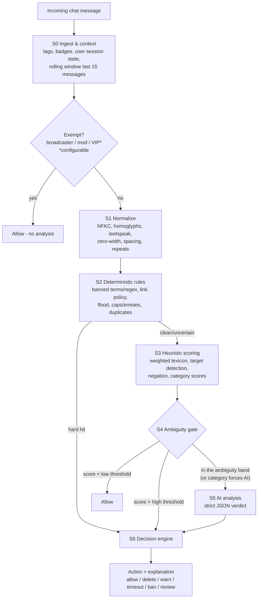

# OZENMod — Moderation Pipeline

The engine that decides what happens to every chat message. It is **local-first**
(deterministic stages run on the streamer's machine in milliseconds), **AI-assisted**
(only ambiguous messages are escalated), and **explainable** (every decision carries
an English reason).

This is *not* a blacklist bot. Word lists are one small stage of a pipeline that
reasons about normalization tricks, context, targets, history and intent.

---

## 1. Goals & non-goals

**Goals**

- Correct decisions on obvious content in **< 5 ms**, without any network call.
- Context-aware judgement on ambiguous content via AI, with strict cost control.
- Zero silent actions: feed, logs and dashboard always show *why*.
- Fairness mechanics: warnings before sanctions (configurable), exemptions,
  severity bypass only for extreme content.

**Non-goals**

- Perfect irony detection (we detect what context allows and route true
  uncertainty to human review).
- Storing chat history beyond the rolling in-memory context window.

## 2. Pipeline overview



All stages up to S4 are pure synchronous TypeScript in `packages/core` — no I/O,
fully unit-testable. S5 is the only network stage and is skipped for the vast
majority of messages (target: **≥ 95 % of messages resolved locally**).

## 3. Stage details

### S0 — Ingest & context assembly

- Parses IRC tags: user id, badges (broadcaster/mod/VIP/sub), message id, emote
  ranges (emotes are excluded from text analysis but counted for spam).
- Builds the **context snapshot**: the user's session state (strikes, last action,
  first-time chatter?, account age bucket if available), the channel policy, and a
  rolling window of the last ~15 messages (in memory only — never persisted).

### S1 — Normalization (defeats evasion)

Produces a canonical text used by all later stages, while keeping the original for
explanations:

- Unicode NFKC fold + case fold; strip zero-width/invisible characters.
- **Homoglyph folding** (Cyrillic/Greek/fullwidth look-alikes → ASCII).
- **Leetspeak map** (`1→i, 3→e, 4→a, @→a, $→s, 0→o`, …) applied as a parallel
  candidate string (so "1337" in a normal sentence is not mangled).
- Collapse repeated characters (`niiiice → niice/nice` candidates) and separator
  injection (`b.a.d`, `b a d` → `bad` candidate).
- Strip emotes (by tag ranges), URLs extracted as tokens for S2.

Matching in S2/S3 runs against the original **and** the normalized candidates, so
`sc4m l1nk` and `s c a m` hit the same rules as `scam`.

### S2 — Deterministic rules (hard, instant)

| Rule family | Behavior |
| --- | --- |
| Streamer banned terms / regex | Each entry has a severity (low → strike, high → instant action). Matched against normalized candidates. |
| Link policy | `block-all` / `trusted-list` / `allow`. Suspicious TLDs, IP-literals, URL shorteners and known scam patterns ("free bits", "become famous") escalate severity. Permitted for subs/regulars if configured. |
| Flood / rate | Sliding window per user (N messages / T seconds) and burst detection across users (raid heuristic → conservative mode). |
| Repetition / duplicates | Near-duplicate detection (SimHash) of the user's recent messages and copypasta bursts across users. |
| Composition | Caps ratio, emote count, symbol ratio, mention count, message length — all thresholds configurable. |

Hard hits (severity ≥ instant) go straight to S6 with a deterministic reason like
*"Blocked link (URL shortener) — link policy: trusted list only"*.

### S3 — Heuristic scoring (fast classifier)

- Weighted multi-category lexicon with context multipliers:
  - **Target detection**: `@user` / reply / second-person raises harassment weight;
    self-directed or third-party-absent lowers it.
  - **Negation & quotation dampening** ("he called me a ___" ≠ calling someone ___).
  - **First-time chatter & account-age boost** (configurable).
  - **Session history**: prior strikes raise the score slightly (recidivism).
- Output: per-category scores in `[0,1]` (harassment, hate, threat, sexual, spam,
  scam, self-harm-encouragement, toxicity) + an aggregate.

### S4 — Ambiguity gate (the cost controller)

- Two thresholds per sensitivity preset (lenient / balanced / strict):
  `allow if aggregate < T_low`, `act locally if > T_high`, **else escalate to AI**.
- Certain categories always prefer AI when non-zero (irony-prone: harassment
  between regulars, borderline threat vs. gaming trash talk) — unless the AI
  budget is exhausted.
- **AI budget**: max calls/minute (default 20) with a small queue; over budget →
  the *fallback policy* applies (`conservative-local`: treat band as "review" for
  high categories, allow for low ones).
- **Response cache**: identical normalized text from the same user within 5 min
  reuses the previous verdict (copypasta-friendly).

### S5 — AI analysis

See [AI-PROVIDERS.md](./AI-PROVIDERS.md) for the provider contract. The request
contains: channel rule summary (compact), the last ~10 context messages (author
role + text, truncated), the target message, and the user's session strike count.
The response is **strict JSON** validated against a zod schema:

```ts
{
  action: "allow" | "delete" | "warn" | "timeout" | "ban" | "review",
  category: "harassment" | "hate" | "threat" | "sexual" | "spam" | "scam" | "toxicity" | "none",
  severity: 0..3,
  confidence: 0..1,
  reason: string   // one sentence, English, shown to humans
}
```

Malformed responses are retried once with a repair prompt, then discarded in favor
of the fallback policy. Soft timeout 2 s, hard 5 s — chat never blocks on the AI
(actions are applied asynchronously; Twitch tolerates moderation a moment after
the message).

### S6 — Decision engine (policy → action)

Maps `(verdict, channel policy, user session state)` to a final action:

1. **Severity bypass:** severity 3 (explicit threats, doxxing, slurs, scam links)
   skips the ladder → immediate configured action (default: ban for threats/doxx,
   timeout 24 h for slurs, delete+timeout for scam links).
2. **Warning ladder** for severity 1–2 (see §5).
3. **Cooldown:** a user already actioned in the last N seconds isn't double-punished
   for queued messages (the flood rule handles the burst itself).
4. **Review:** low confidence (< 0.6 by default) or explicit `review` verdict →
   human review queue instead of action (message stays up, configurable to hold).
5. Emits: the Twitch API calls to perform, the feed/log event **with reason**, the
   database deltas (counters, warnings), and the optional chat reply template.

## 4. Decision types (all explainable)

| Decision | Effect | Example logged reason |
| --- | --- | --- |
| **Allow** | Nothing (majority of messages) | *"Clean (aggregate 0.04)"* — feed shows allowed messages dimmed |
| **Ignore** | Nothing + suppress repeated identical alerts | *"Duplicate of an event already actioned 12 s ago"* |
| **Delete** | Remove the single message | *"Advertising: unsolicited follow-for-follow promotion"* |
| **Warn** | Delete + chat warning `@user warning 1/3: <reason>` (or native Twitch warning) | *"Targeted insult toward @viewer — strike 1/3"* |
| **Timeout** | Delete + timeout N seconds | *"Repeated harassment after warning — strike 3/3, timeout 30 min"* |
| **Ban** | Permanent ban | *"Explicit threat of violence (severity 3) — immediate ban"* |
| **Review** | Queue for human decision | *"Possible sarcasm between regulars — confidence 0.41, needs human eyes"* |

## 5. Warning ladder

Two modes, both **session-scoped** (counters reset when the stream ends; the
"24-hour" alternative is a config option):

- **Mode A — Warn then sanction** (default): strikes 1..N-1 → chat warnings
  (message deleted, public or native Twitch warning), strike N → final action
  (timeout duration or ban, configurable).
- **Mode B — Escalating timeouts:** each strike maps to a timeout duration from a
  user-editable ladder (e.g. 10 s → 5 min → 30 min), last step = final action.

Storage & cleanup are defined in [DATABASE.md §4](./DATABASE.md): a strike record
lives at `sessions/{uid}/warnings/{userId}` and is **deleted the moment the final
action fires** (and the whole session node is deleted at stream end) — warnings are
temporary data by design and never accumulate.

## 6. Categories & default severities

| Category | Examples | Default outcome (balanced preset) |
| --- | --- | --- |
| Harassment / insults | targeted name-calling, dogpiling | ladder |
| Hate / discrimination | slurs, identity attacks | severity 3 → 24 h timeout or ban |
| Threats / violence | "I will find you…" | severity 3 → ban |
| Sexual content | explicit remarks, minors ⇒ always severity 3 | ladder / instant |
| Spam / flood | repeated messages, caps walls, emote walls | delete, ladder on repeat |
| Advertising | "follow my channel", referral links | delete |
| Scam / phishing | "free bits", fake giveaways, shady shorteners | delete + timeout, severity 3 if credential-phishing |
| Evasion | tricks defeated by S1 (leet/homoglyph/spacing) | treated as the underlying category, +1 severity |
| Toxicity (general) | non-targeted vulgarity above channel tolerance | configurable: allow / delete / ladder |

Every category can be toggled and its threshold tuned per channel
(`/dashboard/ai` + desktop settings).

## 7. Performance targets

| Metric | Target |
| --- | --- |
| Local pipeline latency (S0–S4, p99) | < 5 ms |
| Share of messages resolved without AI | ≥ 95 % (typical channels ≥ 98 %) |
| AI soft/hard timeout | 2 s / 5 s |
| Action round-trip (message → Twitch action, with AI) | < 3 s p95 |
| Memory (10k-message context churn) | < 100 MB in the app |

## 8. Manual actions — the AI Assistant

Automatic moderation is the engine's job; the **AI Assistant** is the streamer's
steering wheel. It converts plain-English commands into the same structured
actions the pipeline emits, so manual and automatic moderation share one audit
trail, one warning ladder and one undo model.

### 8.1 Command model

```ts
interface CommandIntent {
  action:
    | "ban" | "unban" | "timeout" | "untimeout"
    | "warn" | "unwarn" | "clear_strikes"
    | "delete_messages" | "purge_user"
    | "approve_review" | "remove_review"
    | "add_banned_term" | "remove_banned_term"
    | "add_trusted_domain" | "remove_trusted_domain"
    | "set_link_policy" | "set_sensitivity" | "toggle_category" | "set_ai_budget"
    | "exempt_user" | "unexempt_user"
    | "query_user" | "query_stats" | "query_actions"
    | "undo_last" | "unknown";
  target?: string;              // Twitch login, resolved case-insensitively
  durationSeconds?: number;     // timeouts
  reason?: string;              // optional everywhere; default provided when absent
  args?: Record<string, string>;
  needsConfirmation: boolean;   // forced true for tier-2 actions
  confidence: number;           // parser confidence 0..1
  reply: string;                // assistant's English response shown in the panel
}
```

Parsing is an AI task with a strict JSON schema
([AI-PROVIDERS.md §7](./AI-PROVIDERS.md)); a local slash-grammar (`/ban user
reason`, `/timeout user 10m`, `/unwarn user`, `/stats`) covers every action when
the AI is unavailable.

### 8.2 Risk tiers

| Tier | Actions | Behavior |
| --- | --- | --- |
| 1 — reversible | warn, unwarn, clear strikes, timeout ≤ 24 h, untimeout, unban, delete/purge, review decisions, rule/sensitivity edits, queries | Execute immediately; result card with one-click **Undo** (inverse op stored per command) |
| 2 — heavy | permanent ban, timeout > 24 h, mass actions (all-user strike resets), bulk term imports | Parsed card shown first; requires explicit **Confirm** |

An "always ask before executing" toggle upgrades everything to tier 2. Ambiguous
parses (confidence < 0.7, unknown target) never execute — the assistant asks a
clarifying question instead.

### 8.3 Execution paths

- **Desktop app:** the panel talks to the local bot directly — parse and execute
  in-process, instant.
- **Web dashboard:** the raw command is queued in the session's `commands` node;
  the bot polls it (ETag, ~3 s), parses, executes, and writes the result back —
  the dashboard renders the same action card. Queue entries are capped and die
  with the session ([DATABASE.md §2](./DATABASE.md)).
- Commands appear in Moderation history with source **Manual · AI Assistant**,
  with the same explanations as automatic decisions. Undo entries are valid for
  the current session.

## 9. Testing strategy

- **Golden corpus** per category (clean, obvious, ambiguous, evasion variants) run
  against S1–S4 in unit tests — every rule change must keep the corpus green.
- **Evasion fuzzing**: property tests generate leet/homoglyph/spacing variants of
  banned terms and assert S1 folds them.
- **Decision-engine tests**: ladder progression, severity bypass, cooldowns,
  session cleanup.
- **Provider contract tests**: verdict schema validation, timeout, fallback paths
  (with mocked providers; a live Pollinations smoke test runs in CI non-blocking).
